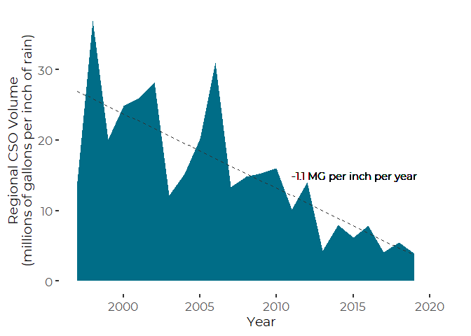
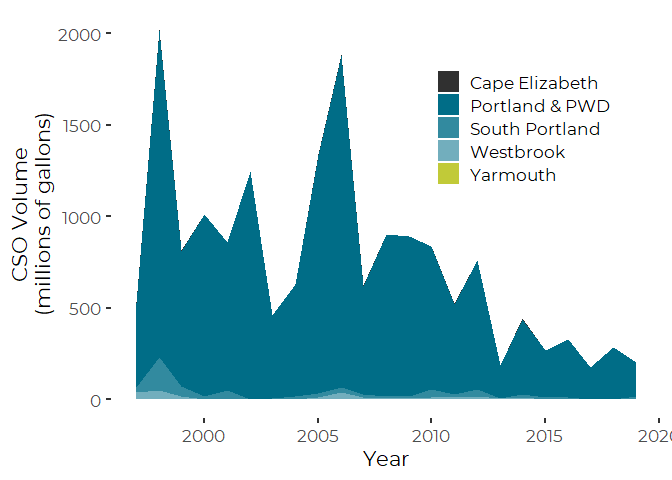
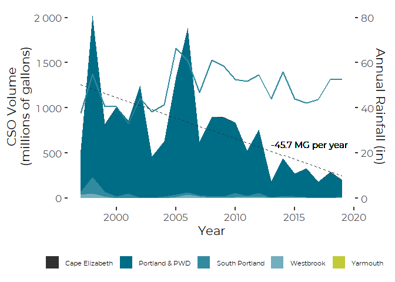
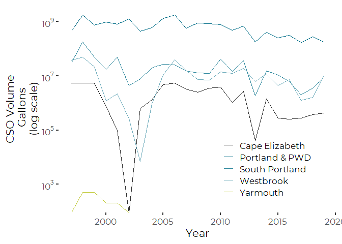
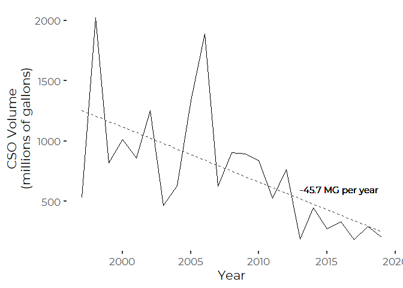
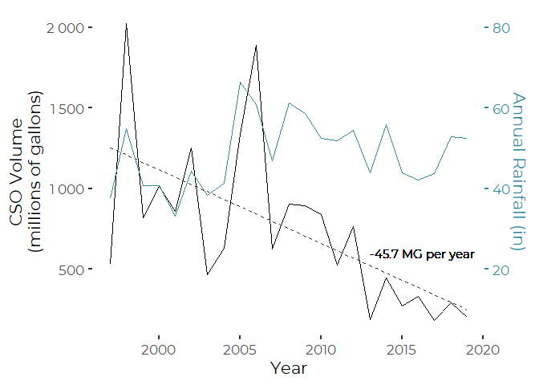

Casco Bay CSO Exploratory Analysis and Graphics
================
Curtis C. Bohlen, Casco Bay Estuary Partnership

-   [Load DEP Data](#load-dep-data)
    -   [Establish Folder References](#establish-folder-references)
-   [Load Weather Data](#load-weather-data)
    -   [Establish Folder Reference](#establish-folder-reference)
    -   [Access data](#access-data)
    -   [Examine Correlations](#examine-correlations)
-   [Identify Casco Bay CSO Communities by
    Name](#identify-casco-bay-cso-communities-by-name)
-   [Casco Bay Towns Data](#casco-bay-towns-data)
-   [Totals Data](#totals-data)
-   [Merge Three Data Sets](#merge-three-data-sets)
-   [Graphics](#graphics)
    -   [CSO Volumes Per Inch of Rain](#cso-volumes-per-inch-of-rain)
        -   [Linear Model to Extract
            Slope](#linear-model-to-extract-slope)
    -   [Regional CSO Volumes (by Town)](#regional-cso-volumes-by-town)
        -   [Linear Regression to Extract
            Slope](#linear-regression-to-extract-slope)
    -   [Total Discharges](#total-discharges)
    -   [Total Outfalls](#total-outfalls)
        -   [Regression to Extract Slope](#regression-to-extract-slope)
-   [Summary Table 2019](#summary-table-2019)


\#Load Libraries

``` r
library(tidyverse)
#> -- Attaching packages --------------------------------------- tidyverse 1.3.0 --
#> v ggplot2 3.3.3     v purrr   0.3.4
#> v tibble  3.0.5     v dplyr   1.0.3
#> v tidyr   1.1.2     v stringr 1.4.0
#> v readr   1.4.0     v forcats 0.5.0
#> -- Conflicts ------------------------------------------ tidyverse_conflicts() --
#> x dplyr::filter() masks stats::filter()
#> x dplyr::lag()    masks stats::lag()

library(CBEPgraphics)
load_cbep_fonts()
theme_set(theme_cbep())

library(corrplot)
#> corrplot 0.84 loaded
```

# Load DEP Data

## Establish Folder References

``` r
sibfldnm <- 'Derived_Data'
parent   <- dirname(getwd())
sibling  <- file.path(parent,sibfldnm)

dir.create(file.path(getwd(), 'figures'), showWarnings = FALSE)
```

``` r
fn <-'DEP_Annual_Totals.csv'
fpath <- file.path(sibling, fn)
the_data <- read_csv(fpath, col_types = 
                       c(Community = col_character(),
                         Year = col_integer(),
                         Volume = col_double(),
                         Events = col_double(),
                         Outfalls = col_double()))
```

# Load Weather Data

## Establish Folder Reference

``` r
sibfldnm <- 'Original_Data'
parent   <- dirname(getwd())
sibling  <- file.path(parent,sibfldnm)
```

## Access data

We extract annual Precipitation Totals (in mm), and Annual Days with
more than one tenth of an inch (2.5mm), and one inch (25.4mm) of rain
from the annual weather summaries from NOAA.

``` r
fn <-'Annual_Weather_PWD.csv'
fpath <- file.path(sibling, fn)
rain_data <- read_csv(fpath, col_types =
                       cols(date = col_datetime(format = ""),
                            datatype = col_character(),
                            value = col_double(),
                            attributes = col_character(),
                            station = col_skip())) %>%
  mutate(Year = as.integer(format(date, format = '%Y'))) %>%
  filter (datatype %in% c('PRCP', 'DP10', 'DP1X')) %>%
  select(Year, datatype, value) %>%
  pivot_wider(names_from = datatype, values_from = value) %>%
  rename(Precip_mm = PRCP, GT0.1 = DP10, GT1.0 = DP1X) %>%
  mutate(Precip_in = Precip_mm / 25.4) %>%
  filter(Year > 1996)
```

## Examine Correlations

``` r
cor(rain_data, use = 'pairwise')
#>                Year     GT0.1     GT1.0 Precip_mm Precip_in
#> Year      1.0000000 0.2747309 0.2421001 0.2748405 0.2748405
#> GT0.1     0.2747309 1.0000000 0.5995589 0.7370457 0.7370457
#> GT1.0     0.2421001 0.5995589 1.0000000 0.8812085 0.8812085
#> Precip_mm 0.2748405 0.7370457 0.8812085 1.0000000 1.0000000
#> Precip_in 0.2748405 0.7370457 0.8812085 1.0000000 1.0000000
```

There are what are likely to be statistically significant correlations
between year and number of large storm and total rainfall even over this
short period. (See the Climate Change indicator for analysis of a longer
time series.)

The High correlation between number of large storms and total
precipitation may complicate separating those two factors in any
analysis – but we don’t really need to do that in this worksheet.

# Identify Casco Bay CSO Communities by Name

``` r
cb_cso_towns <- c("Cape Elizabeth",
                "Portland & PWD",
                "South Portland",
                "Westbrook",
                "Yarmouth")            
```

# Casco Bay Towns Data

Although the number of events and outfalls were reported in the 2008 CSO
report for years prior to 19966, they show no variation, suggesting
these data are not meaningful, so we strip them out here.

``` r
cb_towns_data_long <- the_data %>%
  filter(Community %in% cb_cso_towns) %>%
  mutate(VolumeMG = Volume / (10^6)) %>%
  filter(Year > 1996)

cb_towns_data_wide <- cb_towns_data_long %>%
  pivot_wider(Year, names_from = Community,
              values_from = c(Volume, Events, Outfalls),
              names_repair = 'universal') %>%
  rename_with(~ sub('\\.\\.\\.', '.', .x )) %>% # replace triple dots in Portland
  rowwise() %>%
  mutate(Total = sum(c(Volume_Cape.Elizabeth,
                       Volume_Portland.PWD,
                       Volume_South.Portland,
                       Volume_Westbrook,
                       Volume_Yarmouth), na.rm = TRUE),
         PctPortland = Volume_Portland.PWD/Total) %>%
  ungroup()
#> New names:
#> * `Events_Cape Elizabeth` -> Events_Cape.Elizabeth
#> * `Events_Portland & PWD` -> Events_Portland...PWD
#> * `Events_South Portland` -> Events_South.Portland
#> * `Outfalls_Cape Elizabeth` -> Outfalls_Cape.Elizabeth
#> * `Outfalls_Portland & PWD` -> Outfalls_Portland...PWD
#> * ...
```

# Totals Data

This data set includes statewide and Casco Bay annual totals of the DEP
data. Volumes are available both in total discharge volumes each year,
both in Gallons and in Millions of Gallons.

Again, total number of EVENTS in a year is not meaningful, because of
the risk of double counting, so we omit do not sum events.

``` r
annual_data <- the_data %>%
  group_by(Year) %>%
  summarize(TotVol      = sum(Volume,   na.rm = TRUE),
            TotVolMG    = TotVol / (10^6),
            TotOutfalls = sum(Outfalls, na.rm = TRUE),
            
            CBTotVol      = sum(Volume*(Community %in% cb_cso_towns),
                                na.rm = TRUE),
            CBVolMG    = CBTotVol / (10^6),
            CBTotOutfalls = sum(Outfalls*(Community %in% cb_cso_towns),
                                na.rm = TRUE),
            
            CBPctVol       = round(CBTotVol / TotVol, 4) * 100,
            CBPctOutfalls  = round(CBTotOutfalls / TotOutfalls, 4) * 100,
            .groups = 'drop') %>%
  filter(Year > 1996)
```

# Merge Three Data Sets

We produce an annual data set that combines Portland Jetport weather
data, discharge data for the Casco Bay towns, as well as the Casco Bay
and Statewide totals.

``` r
annual_data_all <- rain_data %>%
  left_join(cb_towns_data_wide, by = 'Year') %>%
  select (-Total) %>%
  rename(PctCascoPortland = PctPortland) %>%
  left_join(annual_data, by = 'Year') %>%
  mutate(CSO_MG_per_inch = CBVolMG / Precip_in)
rm(annual_data, cb_towns_data_wide, rain_data, the_data)
```

# Graphics

## CSO Volumes Per Inch of Rain

### Linear Model to Extract Slope

We need the slope here and in later graphics to automatically annotate
the figure with the annual decline in CSO volumes. Unfrtunately, we
cannot as readily automate placement of annotations, so that requires
hand coding for each figure.

``` r
cb_cso_lm <- lm(CSO_MG_per_inch ~ Year, data = annual_data_all)
#summary(cb_cso_lm)
slope = round(coef(cb_cso_lm)[2],1)
theannot <- paste( slope, 'MG per inch per year')
```

``` r
plt <- annual_data_all %>%
  filter (Year > 1995) %>%
  ggplot(aes(x = Year, y = CSO_MG_per_inch)) + 
  geom_area(fill = cbep_colors()[1]) +
  geom_smooth( method = 'lm', se=FALSE,
               color = cbep_colors()[3],
               lwd = 0.5,
               lty = 2) +
  geom_text(aes(x=2011, y=15, label = theannot),
            family = 'Montserrat',
            size = 4,
            hjust = 0) +
  ylab('Regional CSO Volume\n(millions of gallons per inch of rain)') +
  theme(axis.title= element_text(size = 14)) +
  scale_fill_manual(values = cbep_colors2()) +
  xlim(c(1997,2021)) 
plt
#> `geom_smooth()` using formula 'y ~ x'
```

<!-- -->

``` r
ggsave('figures/CSO_MG_per_inch.pdf', device = cairo_pdf, width = 7, height = 5)
#> `geom_smooth()` using formula 'y ~ x'
```

``` r
plt +
  geom_line(aes(y = Precip_in/2), color = cbep_colors()[5]) +
  #geom_smooth( aes(y=Precip_in/2), method = 'lm', se=FALSE, color = cbep_colors()[3]) +
  scale_y_continuous(labels = scales::number,sec.axis = sec_axis(~ . * 2,
                                         name = "Annual Rainfall (in)"))
#> `geom_smooth()` using formula 'y ~ x'
```

<!-- -->

``` r
#ggsave('figures/CSO_MG_per_inch_w_rain.pdf',
#        device = cairo_pdf, width = 7, height = 5)
```

## Regional CSO Volumes (by Town)

### Linear Regression to Extract Slope

``` r
cb_towns_lm <- lm(CBVolMG ~ Year, data = annual_data_all)
#summary(cb_towns_lm)
slope = round(coef(cb_towns_lm)[2],1)
theannot <- paste( slope, 'MG per year')
```

``` r
plt <- cb_towns_data_long %>%
  ggplot(aes(x = Year, y = VolumeMG)) + 
  geom_area(aes(fill = Community)) +
  ylab('CSO Volume\n(millions of gallons)') +
  scale_fill_manual(values = cbep_colors2(), name = '') +
  theme(legend.position=c(.75,.75))
plt
#> Warning: Removed 17 rows containing missing values (position_stack).
```

<!-- -->

``` r
plt +
  geom_line(mapping = aes(y = Precip_in * 25), 
            data = annual_data_all,
            color = cbep_colors()[5],
            lwd = 1) +
  geom_smooth(mapping = aes(y=CBVolMG),
              data = annual_data_all,          
              method = 'lm', se=FALSE,
              color = cbep_colors()[3],
              lwd = 0.5,
              lty = 2) + 
  geom_text(aes(x=2013, y=600, label = theannot),
            family = 'Montserrat',
            fontface = 'plain',
            size = 4,
            hjust = 0) +
  scale_y_continuous(labels = scales::number,sec.axis = sec_axis(~ . / 25,
                                         name = "Annual Rainfall (in)")) +
  theme(legend.position = 'bottom',
        legend.text = element_text(size = 8))
#> `geom_smooth()` using formula 'y ~ x'
#> Warning: Removed 17 rows containing missing values (position_stack).
```

<!-- -->

``` r
#ggsave('figures/CSO_town_area.pdf', device = cairo_pdf, width = 7, height = 5)
```

``` r
plt <- cb_towns_data_long %>%
  ggplot(aes(x = Year, y = Volume)) + 
  geom_line(aes(color = Community)) +
  ylab('CSO Volume\n Gallons\n(log scale)') +
  scale_color_manual(values = cbep_colors2(), name = '') +
  theme(legend.position=c(.75,.25)) +
  scale_y_log10(labels = scales::trans_format("log10",
                                              scales::math_format(10^.x)))
plt
#> Warning: Transformation introduced infinite values in continuous y-axis
#> Warning: Removed 17 row(s) containing missing values (geom_path).
```

<!-- -->

``` r
#ggsave('figures/CSO_town_lines.pdf', device = cairo_pdf, width = 7, height = 5)
```

## Total Discharges

``` r
plt <-annual_data_all %>%
  ggplot(aes(x = Year, y = CBVolMG)) + 
  geom_line() +
  ylab('CSO Volume\n(millions of gallons)') +
  geom_smooth(mapping = aes(y=CBVolMG),
              method = 'lm', se=FALSE,
              color = cbep_colors()[3],
              lty = 2,
              lwd = 0.5) + 
  geom_text(aes(x=2013, y=600, label = theannot),
            family = 'Montserrat',
            size = 4,
            hjust = 0)
plt
#> `geom_smooth()` using formula 'y ~ x'
```

<!-- -->

``` r
ggsave('figures/CSO_total_line.pdf', device = cairo_pdf, width = 7, height = 5)
#> `geom_smooth()` using formula 'y ~ x'
```

``` r
plt +
  geom_line(mapping = aes(y = Precip_in * 25), 
            color = cbep_colors()[5]) +
  scale_y_continuous(labels = scales::number,sec.axis = sec_axis(~ . / 25,
                                         name = "Annual Rainfall (in)")) +
  theme(axis.title.y.right = element_text(color = cbep_colors()[5]),
        axis.text.y.right = element_text(color = cbep_colors()[5]),
        axis.ticks.y.right = element_line(color = cbep_colors()[5]))
#> `geom_smooth()` using formula 'y ~ x'
```

<!-- -->

``` r
ggsave('figures/CSO_total_line_w_rain.pdf', device = cairo_pdf, width = 7, height = 5)
#> `geom_smooth()` using formula 'y ~ x'
```

``` r
annual_data_all %>%
  filter (Year > 1995) %>%
  ggplot(aes(x = Year, y = CBVolMG)) + 
  geom_area(fill = cbep_colors()[1]) +
  geom_line(aes(y = Precip_in * 25)) +
  
  ylab('Regional CSO Volume\n(millions of gallons)') +
  scale_fill_manual(values = cbep_colors2()) +
  scale_y_continuous(labels = scales::number,sec.axis = sec_axis(~ . / 25,
                                         name = "Annual Rainfall (in)")) +
  geom_smooth(mapping = aes(y=CBVolMG),
              method = 'lm', se=FALSE,
              color = cbep_colors()[3],
              lty = 2,
              lwd = 0.5) + 
  geom_text(aes(x=2013, y=600, label = theannot),
            family = 'Montserrat',
            size = 4,
            hjust = 0)
#> `geom_smooth()` using formula 'y ~ x'
```

<!-- -->

``` r
ggsave('figures/CSO_total_area.pdf', device = cairo_pdf, width = 7, height = 5)
#> `geom_smooth()` using formula 'y ~ x'
```

## Total Outfalls

### Regression to Extract Slope

``` r
cb_outfalls_lm <- lm(CBTotOutfalls ~ Year,
                     data = annual_data_all,
                     subset = Year>2001)
#summary(cb_outfalls_lm)
slope = coef(cb_outfalls_lm)[2]
theannot <- paste('Eliminating an outfall every', -round(1/slope,1), 'years')
```

``` r
plt <-annual_data_all %>%
  filter(Year > 2001) %>%  # Outfalls data not available earlier
  ggplot(aes(x = Year, y = CBTotOutfalls)) + 
  geom_point() +
  geom_smooth(se = FALSE, method = 'lm') +
  ylab('CSO Outfalls') +
  geom_text(aes(x=2010, y=47, label = theannot),
            family = 'Montserrat',
            fontface = 'plain',
            size = 4,
            hjust = 0) +
  xlim(c(2000, 2020)) +
  ylim(c(20,50))
plt
#> `geom_smooth()` using formula 'y ~ x'
```

<!-- -->

``` r
#ggsave('figures/CSO_outfalls_points.pdf',
#       device = cairo_pdf, width = 7, height = 5)
```

# Summary Table 2019

Note that it’s really not appropriate to add up events, as events in
different towns may have occurred on the same days, making them the same
events. We do so here for programming simplicity. The total Events value
should be removed before releasing the table.

``` r
cb_towns_data_long %>% 
  filter (Year == 2019) %>%
  select(Community, Events, Outfalls, VolumeMG) %>%
  filter(! is.na(VolumeMG)) %>%
  bind_rows(summarise_all(., funs(if(is.numeric(.)) sum(.) else "Total"))) %>%
  write_csv('Community_table.csv') %>%
  knitr::kable(digits = c(0,0,0,2))
#> Warning: `funs()` is deprecated as of dplyr 0.8.0.
#> Please use a list of either functions or lambdas: 
#> 
#>   # Simple named list: 
#>   list(mean = mean, median = median)
#> 
#>   # Auto named with `tibble::lst()`: 
#>   tibble::lst(mean, median)
#> 
#>   # Using lambdas
#>   list(~ mean(., trim = .2), ~ median(., na.rm = TRUE))
#> This warning is displayed once every 8 hours.
#> Call `lifecycle::last_warnings()` to see where this warning was generated.
```

| Community      | Events | Outfalls | VolumeMG |
|:---------------|-------:|---------:|---------:|
| Cape Elizabeth |      2 |        1 |     0.43 |
| Portland & PWD |     46 |       30 |   184.45 |
| South Portland |      3 |        4 |     8.65 |
| Westbrook      |      4 |        5 |     9.82 |
| Total          |     55 |       40 |   203.35 |
