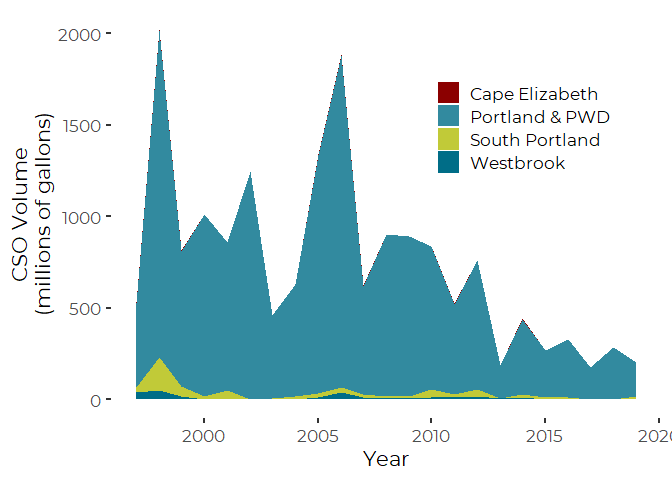
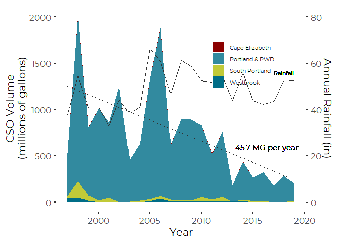
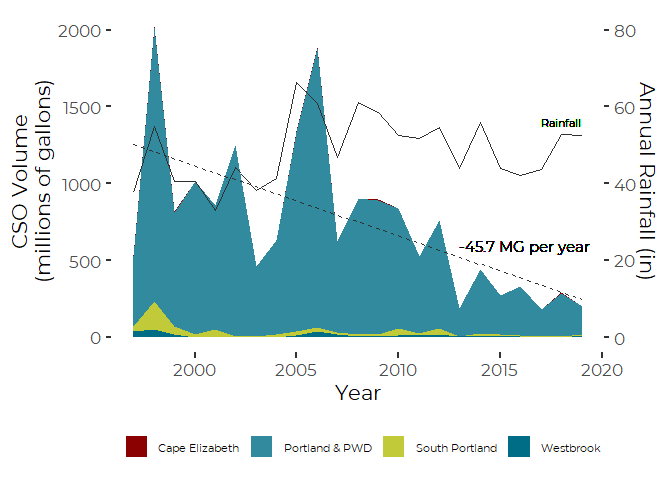

Casco Bay CSO Revised Graphic for Final Graphic Design
================
Curtis C. Bohlen, Casco Bay Estuary Partnership

-   [Load DEP Data](#load-dep-data)
    -   [Establish Folder References](#establish-folder-references)
-   [Load Weather Data](#load-weather-data)
    -   [Establish Folder Reference](#establish-folder-reference)
    -   [Access data](#access-data)
-   [Identify Casco Bay CSO Communities by
    Name](#identify-casco-bay-cso-communities-by-name)
-   [Casco Bay Towns Data](#casco-bay-towns-data)
-   [Merge Two Data Sets](#merge-two-data-sets)
-   [Graphics](#graphics)
    -   [Regional CSO Volumes (by Town)](#regional-cso-volumes-by-town)
        -   [Linear Regression to Extract
            Slope](#linear-regression-to-extract-slope)
        -   [Graphic with Cape Elizabeth in
            Red](#graphic-with-cape-elizabeth-in-red)
-   [Percent Reduction, Two Ways](#percent-reduction-two-ways)
    -   [Simple Year Over Year Change](#simple-year-over-year-change)
    -   [Linear Regression Predictions](#linear-regression-predictions)


\#Load Libraries

``` r
library(tidyverse)
#> Warning: package 'tidyverse' was built under R version 4.0.5
#> -- Attaching packages --------------------------------------- tidyverse 1.3.1 --
#> v ggplot2 3.3.3     v purrr   0.3.4
#> v tibble  3.1.2     v dplyr   1.0.6
#> v tidyr   1.1.3     v stringr 1.4.0
#> v readr   1.4.0     v forcats 0.5.1
#> Warning: package 'tidyr' was built under R version 4.0.5
#> Warning: package 'dplyr' was built under R version 4.0.5
#> Warning: package 'forcats' was built under R version 4.0.5
#> -- Conflicts ------------------------------------------ tidyverse_conflicts() --
#> x dplyr::filter() masks stats::filter()
#> x dplyr::lag()    masks stats::lag()

library(CBEPgraphics)
load_cbep_fonts()
theme_set(theme_cbep())

library(corrplot)
#> Warning: package 'corrplot' was built under R version 4.0.5
#> corrplot 0.88 loaded
```

# Load DEP Data

## Establish Folder References

``` r
sibfldnm <- 'Derived_Data'
parent   <- dirname(getwd())
sibling  <- file.path(parent,sibfldnm)

dir.create(file.path(getwd(), 'figures'), showWarnings = FALSE)
```

``` r
fn <-'DEP_Annual_Totals.csv'
fpath <- file.path(sibling, fn)
the_data <- read_csv(fpath, col_types = 
                       c(Community = col_character(),
                         Year = col_integer(),
                         Volume = col_double(),
                         Events = col_double(),
                         Outfalls = col_double()))
```

# Load Weather Data

## Establish Folder Reference

``` r
sibfldnm <- 'Original_Data'
parent   <- dirname(getwd())
sibling  <- file.path(parent,sibfldnm)
```

## Access data

We extract annual Precipitation Totals (in mm), and Annual Days with
more than one tenth of an inch (2.5mm), and one inch (25.4mm) of rain
from the annual weather summaries from NOAA.

``` r
fn <-'Annual_Weather_PWD.csv'
fpath <- file.path(sibling, fn)
rain_data <- read_csv(fpath, col_types =
                       cols(date = col_datetime(format = ""),
                            datatype = col_character(),
                            value = col_double(),
                            attributes = col_character(),
                            station = col_skip())) %>%
  mutate(Year = as.integer(format(date, format = '%Y'))) %>%
  filter (datatype %in% c('PRCP', 'DP10', 'DP1X')) %>%
  select(Year, datatype, value) %>%
  pivot_wider(names_from = datatype, values_from = value) %>%
  rename(Precip_mm = PRCP, GT0.1 = DP10, GT1.0 = DP1X) %>%
  mutate(Precip_in = Precip_mm / 25.4) %>%
  filter(Year > 1996)
```

# Identify Casco Bay CSO Communities by Name

We remove Yarmouth from the data because their contribution ended twenty
years ago, and is so small that it vanishes in the graphic display.
Adding the town name to the legend, while technically correct, is
confusing.

``` r
cb_cso_towns <- c("Cape Elizabeth",
                "Portland & PWD",
                "South Portland",
                "Westbrook")            
```

# Casco Bay Towns Data

Although the number of events and outfalls were reported in the 2008 CSO
report for years prior to 1996, they show no variation, suggesting these
data are not meaningful, so we strip them out here.

We report results on a millions of gallons basis.

``` r
cb_towns_data_long <- the_data %>%
  filter(Community %in% cb_cso_towns) %>%
  select(-Events, -Outfalls) %>%
  mutate(Volume = Volume / (10^6)) %>%
  filter(Year > 1996)
```

``` r
cb_towns_data_wide <- cb_towns_data_long %>%
  pivot_wider(Year, names_from = Community,
              values_from = Volume) %>%
  rowwise() %>%
  mutate(Total = sum(c(`Cape Elizabeth`,
                       `Portland & PWD`,
                       `South Portland`,
                       Westbrook), na.rm = TRUE),
         PctPortland = `Portland & PWD`/Total) %>%
  ungroup()
```

# Merge Two Data Sets

We produce an annual data set that combines Portland Jetport weather
data, discharge data for the Casco Bay towns, as well as the Casco Bay
and Statewide totals.

``` r
data_combined <- rain_data %>%
  left_join(cb_towns_data_wide, by = 'Year') %>%
  mutate(CSO_MG_per_inch = Total / Precip_in)
```

``` r
rm(cb_towns_data_wide, rain_data, the_data)
```

# Graphics

## Regional CSO Volumes (by Town)

### Linear Regression to Extract Slope

``` r
cb_towns_lm <- lm(Total ~ Year, data = data_combined)
#summary(cb_towns_lm)
slope = round(coef(cb_towns_lm)[2],1)
theannot <- paste( slope, 'MG per year')
```

### Graphic with Cape Elizabeth in Red

``` r
plt <- cb_towns_data_long %>%
  ggplot(aes(x = Year, y = Volume)) + 
  geom_area(aes(fill = Community)) +
  ylab('CSO Volume\n(millions of gallons)') +
  scale_fill_manual(values = c('red4', cbep_colors()[c(5,4,1)]), name = '') +
  theme(legend.position=c(.75,.75))
plt
```

<!-- -->

``` r
plt +
  geom_line(mapping = aes(y = Precip_in * 25), 
            data = data_combined,
            color = cbep_colors()[3],
            lwd = 0.5) +
  geom_smooth(mapping = aes(y=Total),
              data = data_combined,          
              method = 'lm', se=FALSE,
              color = cbep_colors()[3],
              lwd = 0.5,
              lty = 2) + 
  geom_text(aes(x=2013, y=600, label = theannot),
            family = 'Montserrat',
            fontface = 'plain',
            size = 4,
            hjust = 0) +
  geom_text(aes(x=2017, y=1400, label = 'Rainfall'),
            family = 'Montserrat',
            fontface = 'plain',
            size = 3,
            hjust = 0) +
  scale_y_continuous(sec.axis = sec_axis(~ . / 25,
                                         name = "Annual Rainfall (in)")) +
  theme(legend.text = element_text(size = 8))
#> `geom_smooth()` using formula 'y ~ x'
```

<!-- -->

``` r
ggsave('figures/CSO_town_area_REVISED_red.pdf',
       device = cairo_pdf, width = 7, height = 5)
#> `geom_smooth()` using formula 'y ~ x'
```

``` r
plt +
  geom_line(mapping = aes(y = Precip_in * 25), 
            data = data_combined,
            color = cbep_colors()[3],
            lwd = 0.5) +
  geom_smooth(mapping = aes(y=Total),
              data = data_combined,          
              method = 'lm', se=FALSE,
              color = cbep_colors()[3],
              lwd = 0.5,
              lty = 2) + 
  geom_text(aes(x=2013, y=600, label = theannot),
            family = 'Montserrat',
            fontface = 'plain',
            size = 4,
            hjust = 0) +
  geom_text(aes(x=2017, y=1400, label = 'Rainfall'),
            family = 'Montserrat',
            fontface = 'plain',
            size = 3,
            hjust = 0) +
  scale_y_continuous(sec.axis = sec_axis(~ . / 25,
                                         name = "Annual Rainfall (in)")) +
  theme(legend.position = 'bottom',
        legend.text = element_text(size = 8))
#> `geom_smooth()` using formula 'y ~ x'
```

<!-- -->

``` r
ggsave('figures/CSO_town_area_REVISED_red_bottom.pdf',
       device = cairo_pdf, width = 7, height = 5)
#> `geom_smooth()` using formula 'y ~ x'
```

# Percent Reduction, Two Ways

## Simple Year Over Year Change

Comparing first year to last year in the record. This is not the best
way to go, since it does not address year to year variability.

``` r
data_combined %>%
  select(Year, Total) %>%
  summarize(pct_chng= (last(Total) - first(Total)) / first(Total))
#> # A tibble: 1 x 1
#>   pct_chng
#>      <dbl>
#> 1   -0.618
```

## Linear Regression Predictions

``` r
df <- tibble(Year = c(1997, 2019))
res <- predict(cb_towns_lm , newdata = df)
(res[2]-res[1])/res[1]
#>          2 
#> -0.8017867
```

So overall, discharges have declined about 80% since 1997.
