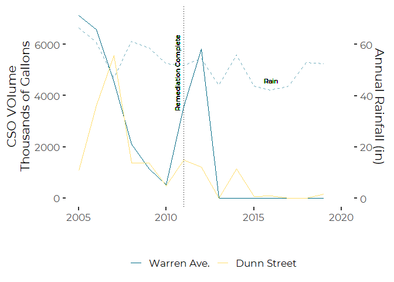
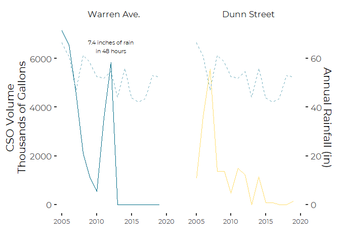

Casco Bay CSO Data Analysis, Portland CSO Graphics
================
Curtis C. Bohlen, Casco Bay Estuary Partnership

  - [Load Data](#load-data)
      - [Establish Folder References](#establish-folder-references)
      - [Load Data](#load-data-1)
      - [Load Weather Data](#load-weather-data)
          - [Access data](#access-data)
      - [Combine Data](#combine-data)
      - [Load Locations Lookup Table](#load-locations-lookup-table)
  - [Graphics](#graphics)
      - [Combined, one panel](#combined-one-panel)
      - [Combined, Two panels](#combined-two-panels)


\#Load Libraries

``` r
library(tidyverse)
#> -- Attaching packages -------------------------------------------- tidyverse 1.3.0 --
#> v ggplot2 3.3.2     v purrr   0.3.4
#> v tibble  3.0.3     v dplyr   1.0.2
#> v tidyr   1.1.2     v stringr 1.4.0
#> v readr   1.3.1     v forcats 0.5.0
#> -- Conflicts ----------------------------------------------- tidyverse_conflicts() --
#> x dplyr::filter() masks stats::filter()
#> x dplyr::lag()    masks stats::lag()
library(readxl)

library(CBEPgraphics)
load_cbep_fonts()
theme_set(theme_cbep())
```

niece

# Load Data

## Establish Folder References

``` r
sibfldnm   <- 'Original_Data'
niecefldnm <- 'PWD_Remediation'
parent     <- dirname(getwd())
sibling    <- file.path(parent,sibfldnm)
niece      <- file.path(sibling, niecefldnm)

dir.create(file.path(getwd(), 'figures'), showWarnings = FALSE)
```

## Load Data

``` r
fn <- "CSO-002_and_CSO-004_Annual_Overflow_Volumes.xlsx"
fpath <- file.path(niece, fn)
remediation_data <- read_excel(fpath, skip = 1,
                           col_types = c("numeric", "numeric", "numeric"),
                           col_names = c('Year', 'CSO_002', 'CSO_004'))

remediation_long <- remediation_data %>%
  pivot_longer(cols = c(2:3), names_to = 'CSO', values_to = 'Volume')
```

## Load Weather Data

### Access data

We extract annual Precipitation Totals (in mm), and Annual Days with
more than one tenth of an inch (2.5mm), and one inch (25.4mm) of rain
from the annual weather summaries from NOAA.

``` r
fn <-'Annual_Weather_PWD.csv'
fpath <- file.path(sibling, fn)
rain_data <- read_csv(fpath, col_types =
                       cols(date = col_datetime(format = ""),
                            datatype = col_character(),
                            value = col_double(),
                            attributes = col_character(),
                            station = col_skip())) %>%
  mutate(Year = as.integer(format(date, format = '%Y'))) %>%
  filter (datatype %in% c('PRCP', 'DP10', 'DP1X')) %>%
  select(Year, datatype, value) %>%
  pivot_wider(names_from = datatype, values_from = value) %>%
  rename(Precip_mm = PRCP, GT0.1 = DP10, GT1.0 = DP1X) %>%
  mutate(Precip_in = Precip_mm / 25.4) %>%
  filter(Year > 2004)
```

## Combine Data

``` r
remediation_data <- remediation_data %>%
  left_join(rain_data, by = 'Year')
```

## Load Locations Lookup Table

``` r

locations_lookup <- tribble(
  ~CSO, ~Location,
'CSO_002', 'Warren Ave.',
'CSO_004', 'Dunn Street')

remediation_long <- remediation_long%>%
  left_join(locations_lookup, by = 'CSO')
```

# Graphics

## Combined, one panel

``` r
labs = locations_lookup$Location
names(labs) = locations_lookup$CSO


plt <- ggplot(remediation_long) +
  geom_text(x = 2016, y = 4600,
            label = 'Rain',
            size = 3) +
  geom_line(aes(x = Year, y = Volume/10^3, color = CSO)) +
  
  geom_line(data = remediation_data,
            mapping = aes(x = Year, y = Precip_in * 100 ),
            color = cbep_colors()[6],
            lty = 2) +
  
  geom_vline(xintercept = 2011, lty = 3) +
  geom_text(x = 2010.6, y = 3400,
            label = 'Remediation Complete',
            angle = 90,
            size = 3,
            hjust = 0) +
  
  scale_color_manual(values = cbep_colors(),
                     name = '',
                     labels = labs) +
  scale_y_continuous(sec.axis = sec_axis(~ . /100,
                                         name = 'Annual Rainfall (in)')) +
  scale_x_continuous(limits = c(2005, 2020)) +
  
  
  theme(legend.position = 'bottom') +
  
  
  ylab('CSO VOlume\nThousands of Gallons') +
  xlab('')
plt
```

<!-- -->

``` r


ggsave('figures/Westbrook_CSO_Highlight_Sites.pdf', device = cairo_pdf, width = 7, height = 5)
```

## Combined, Two panels

``` r

annot <- tibble(x = c(2012, 0),
                y = c(6500, 0),
                CSO = c('CSO_002', 'CSO_004'),
                lab = c('7.4 inches of rain\nin 48 hours', ''))

plt <- remediation_long %>%
  left_join(rain_data, by = 'Year') %>%
  ggplot() +

  geom_line(aes(x = Year, y = Volume/10^3, color = CSO)) +
  geom_line(data = remediation_data,
            mapping = aes(x = Year, y = Precip_in * 100 ),
            color = cbep_colors()[6],
            lty = 2) +
  
  geom_text(data = annot,
            mapping = aes(x, y, label = lab),
            size = 3,
            hjust = 0.5) +
  facet_grid(cols = vars(CSO),
             labeller = labeller(CSO = labs)) +
  
  scale_color_manual(values = cbep_colors(),
                     name = '',
                     labels = labs) +
  scale_y_continuous(sec.axis = sec_axis(~ . /100,
                                         name = 'Annual Rainfall (in)')) +
  scale_x_continuous(limits = c(2005, 2020)) +
  
  
  theme(legend.position = '',
        axis.text.x = element_text(size = 10),
        panel.spacing = unit(2, "lines")) +
  
  
  ylab('CSO Volume\nThousands of Gallons') +
  xlab('')
plt
#> Warning: Removed 1 rows containing missing values (geom_text).
```

<!-- -->

``` r


ggsave('figures/Westbrook_CSO_Highlight_Sites_alt.pdf', device = cairo_pdf, width = 7, height = 5)
#> Warning: Removed 1 rows containing missing values (geom_text).
```

\`\`\`
